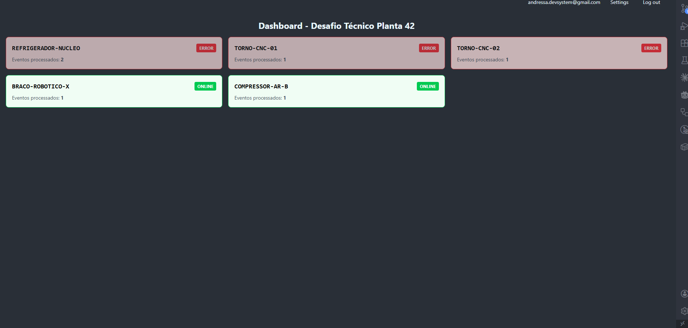
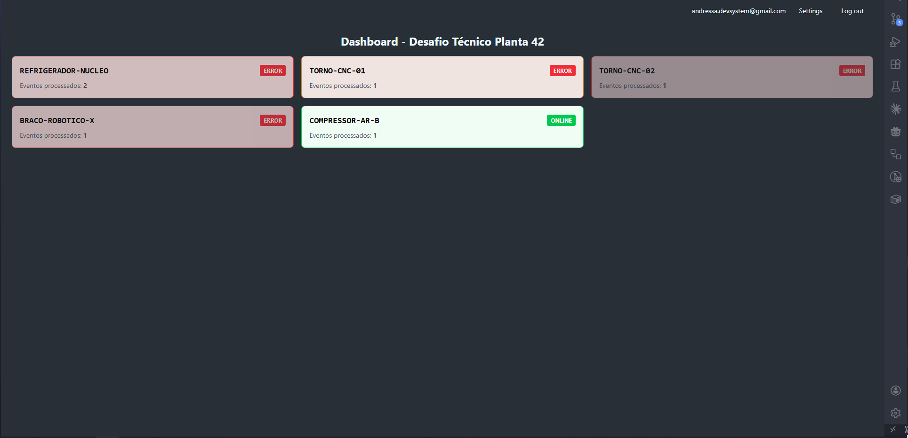
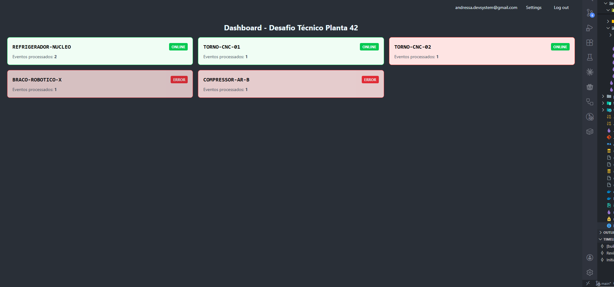

# 🏭 Desafio Técnico Elite: Motor de Estado em Tempo Real (W-Core)
Desafio voltado para um motor de telemetria construído em Elixir e focado em suportar altos picos de tráfego sem derrubar o banco de dados.


<p align="center">Tela de dashboard em Phoenix LiveView onde exibe as máquinas e sinaliza seu status (os dados que aparecem na imagem foram apenas utilizados para testes unitários)</p>

## 🎯 O Desafio
Sistemas de missão crítica não podem lidar com atrasos. O Desafio Técnico - Planta 42 exigiu resolver o cenário de **lock de escrita no banco de dados relacional, atrasos em painéis de operação e falsos positivos**, garantindo maior agilidade ao reportar falhas em máquinas.

## 🚀 A Solução
Para garantir a imunidade a picos de tráfego e latência zero, o sistema foi pensado abandonando o fluxo tradicional de requisições diretas aos bancos de dados.

  * **Ingestão em Memória:** Uso de OTP e ETS para processar milhares de eventos em memória cache.

  * **Reatividade Pura:** Interface construída com Phoenix LiveView, garantindo que a tela pulse em tempo real perante anomalias na fábrica, via WebSockets, sem necessidade de polling.

  * **Persistência Estratégica:** Banco de dados SQLite local, recebendo dados através de um padrão Write-Behind gerido pelo OTP, garantindo o histórico à prova de falhas e reinicializações.

## 🧠 Arquitetura e Decisões Técnicas

Documentar cada passo foi essencial para compreender e conectar melhor cada estrutura. Convido você a ler os rascunhos onde há explicações mais detalhadas sobre o desafio e as soluções encontradas:

  * [Step-1: Fundação](docs/drafts/step-1-foundation.md)
  * [Step-2: Memória Engine com ETS](docs/drafts/step-2-otp-ets.md)
  * [Step-3: Design System e LiveView](docs/drafts/step-3-liveview-ds.md)
  * [Step-4: Fase de Testes](docs/drafts/step-4-tests.md)
  * [Step-5: Infraestrutura](docs/drafts/step-5-infra-arch.md)

## 🛠️ Stack Tecnológica
  * Linguagem e Framework: Elixir + Phoenix LiveView
  * Banco de Dados: SQLite local
  * Autenticação: Gerada exclusivamento via phx.gen.auth
  * Estado e Cache: Uso obrigatório de ETS e processo OTP para fluxo de dados
  * Design System: Componentes HEEx puros (nada de bibliotecas pesadas de UI de terceiros)
  * Infraestrutura: Uma release Elixir Pura (rodando em dockerfile simples)

## 💡 Sobre o Desenvolvimento
Aprender Erlang VM foi definitivamente curioso e interessante. Minha abordagem para o desafio seguiu passos que levo à risca em qualquer outro projeto: primeiro, aprofundei meus conhecimentos em Elixir + Phoenix LiveView. Em seguida, transformei minha base sólida de desenvolvimento web, APIs e bancos de dados para o paradigma funcional. O resultado disso é um sistema que atende as exigências e que ainda sim pode ser submetido a melhorias para se adequar a novas necessidades.

## ⚙️ Como Rodar Localmente
```
# Clone o repositório
git clone https://github.com/nevaskab/desafio_tecnico.git

# Suba a infraestrutura Docker
docker compose up -d --build

# Acesse no navegador
http://localhost:4000/
```
### Imagens de Phoenix LiveView Dashboard




## Autor

<a>
<br />
<b>Andressa Martins</b></a>

Feito por Andressa Martins. Entre em contato <3.

<a href="mailto:andressa.devsystem@gmail.com"></a>