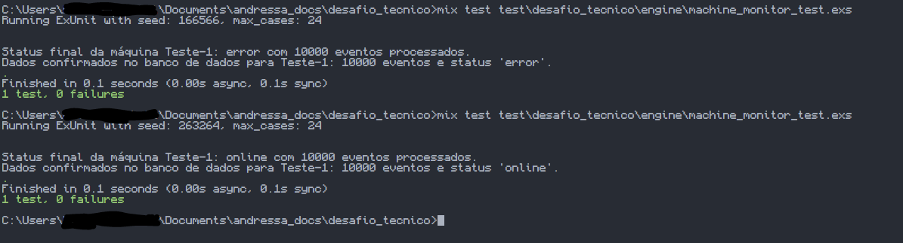

# Passo 4 - Simulação de Caos (Testes Rigorosos)

## Objetivo
Provar a estabilidade da arquitetura baseada em **GenServer + ETS  +  Write-Behind**, garantindo imunidade a condições de corrida e validando o desacoplamento de I/O em cenários de alta concorrência.

## Provas Arquiteturais Coletadas

1. **Imunidade à Condição de Corrida (ETS e GenServer):**

    * **Problema Comum:** Em linguagens tradicionais, múltiplas threads atualizando um mesmo contador na memória causam sobrescrita de dados (Race Condition).
    * **Teste:** A asserção `assert count == 10000` passou perfeitamente. Isso ocorre porque o `GenServer` age como um funil natural. Sua caixa de entrada recebe os 10.000 eventos de forma concorrente, mas os processa de forma estritamente serial (um por vez).

2. **Resiliência do Write-Behind (SQLite):**
    * **Problema Comum:** Injetar 10.000 eventos diretamente em um banco SQL tradicional geraria gargalo de I/O, travamento de conexões e timeouts.
    * **Teste:** O teste injetou uma mensagem forçada de `:flush_to_sqlite` após a chuva de eventos. A asserção validou que o Ecto persistiu perfeitamente o estado final (contagem de 10.000 e o status atual) realizando apenas **uma única transação de banco de dados** em vez de 10.000 transações individuais. O gargalo de disco foi completamente eliminado.

**Teste de resiliência em 0.1s sync**

É possível observer que o teste informa a quantidade de eventos (que para o teste foram 10000) e o status atual de estado.

